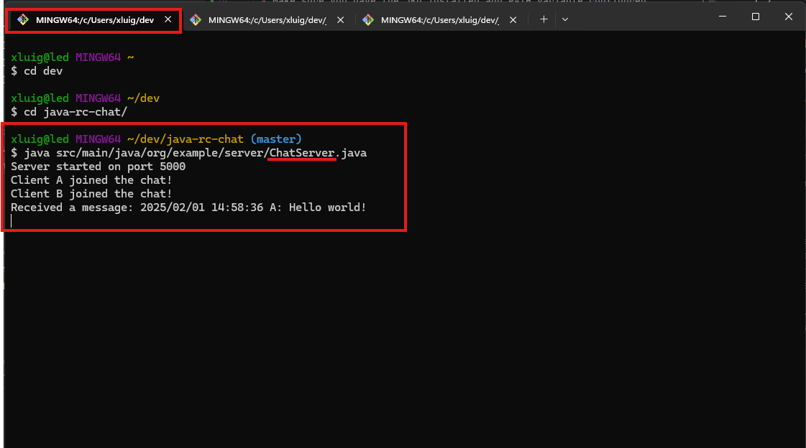

# Java RC Chat
This repository contains the code to run a simple local RC chat made in Java.

The goal was to create a simple toy project to play with the Observer pattern.

## How to run
 - Make sure you have the JDK installed and PATH variable configured
 - Run `java -version` inside your terminal to make sure Java is configured appropriately
 - Run the followings in separate terminals: 
   - Server: `java src/main/java/org/example/server/ChatServer.java`
   - Client: `java src/main/java/org/example/client/ChatClient.java`
 
The first java command runs the Server process, the second runs the Client process.

You only need one server running, whilst you can have as many Clients as you wish.
 

### Notes:
 - `hostname` and `port` are hardcoded in both the Client and Server, change them as you like
 - Default values:
   - hostname: `localhost`
   - port: `5000`
 

 - I have used Java 23 (`openjdk-23.0.2`) to run the project, but without any specific version feature 
 - Java 8 and subsequent versions should also work fine

## Example usage
### Server

### Client A

### Client B

